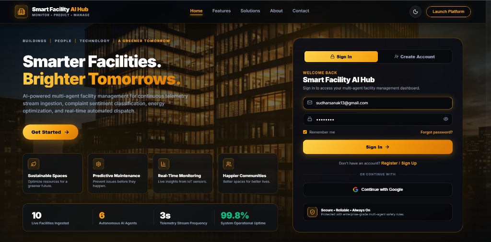
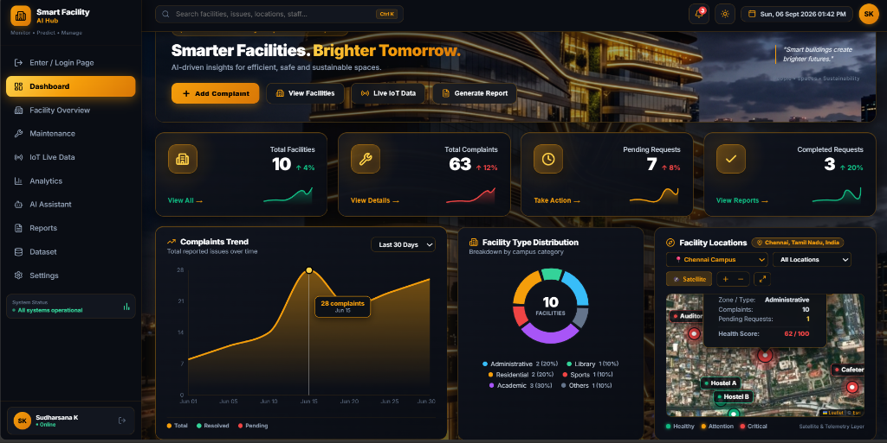
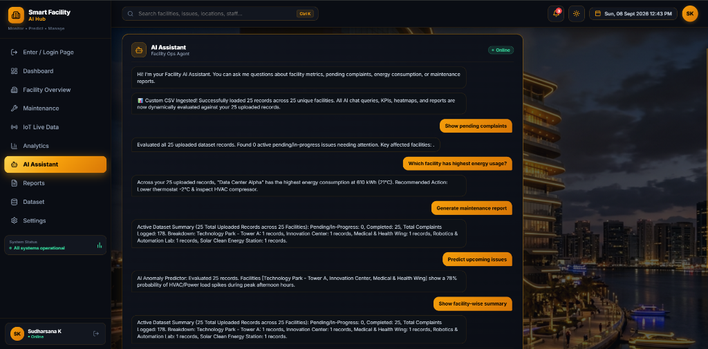
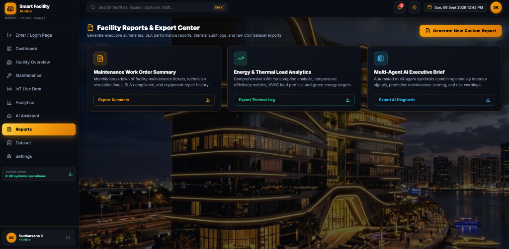

# 🏢 Smart Facility AI Hub — Multi-Agent Management Platform

A state-of-the-art, real-time multi-agent AI web application for intelligent facility telemetry monitoring, predictive maintenance, dynamic complaint sentiment classification, thermal & energy usage optimization, automated control dispatching, and interactive satellite mapping.

---

## 🖼️ Application Preview & Screenshots

### 1. Landing & Authentication Page
*Modern, dark-gold themed luxury landing page with Google SSO authentication and live platform telemetry indicators.*



---

### 2. Real-Time Executive Dashboard
*Comprehensive operational hub featuring real-time KPI metrics, complaints trend analysis, facility type distribution, and high-resolution satellite facility mapping.*



---

### 3. Smart Facility Conversational AI Assistant
*Dynamic AI Assistant powered by multi-agent contextual evaluation, capable of querying custom uploaded CSV datasets in real time for pending complaints, energy hotspots, predictive issue warnings, and facility breakdowns.*



---
---

### 4. Facility Reports & Export Center
*Executive report generator for downloading maintenance work order summaries, thermal load logs, and multi-agent AI diagnosis briefs.*



---

## 🌟 Key Features

- **🌐 Interactive Satellite Facility Mapping**: Built with Leaflet & Esri World Imagery, displaying real-time health score status markers, English facility building badges, tooltips, and multi-city campus switching (Chennai, Bengaluru, Hyderabad, Silicon Valley).
- **🤖 Autonomous Multi-Agent AI Engine**:
  - **`data_agent.py`**: Handles live IoT telemetry stream ingestion and rolling buffer window queries.
  - **`complaint_severity_agent.py`**: Performs real-time sentiment analysis and severity scoring on facility complaints.
  - **`energy_optimization_agent.py`**: Computes thermal-occupancy efficiency scores and recommends HVAC compressor adjustments.
  - **`decision_agent.py`**: Automates operational control actions (emergency dispatches, load shedding, thermostat controls).
  - **`insight_agent.py`**: Computes overall facility health metrics and aggregates operational KPIs.
  - **`llm_explanation_agent.py`**: Generates context-aware, natural language explanations for automated decisions.
- **📊 Dynamic CSV Ingestion**: Upload custom facility dataset CSV files to dynamically evaluate metrics, KPIs, chat responses, and heatmaps across custom records.
- **⚡ Real-Time IoT Telemetry Streamer**: Continuous IoT sensor simulation (Energy kW, Temperature °C, HVAC load, Occupancy, Complaints) with live anomaly injection.
- **📄 Reports & Export Center**: Export CSV audit logs, maintenance summaries, and AI executive briefs with one click.

---

## 🛠️ Tech Stack

### **Frontend**
- **Framework**: React 18 + Vite
- AI & Architecture : Multi agent orchestration (6 autonomous agent)
- **Mapping**: Leaflet.js + React-Leaflet (Esri World Imagery Satellite Tiles)
- **Icons**: Lucide React Icons

### **Backend & AI Engine**
- **API Server**: Python + FastAPI + Uvicorn
- **Data Processing**: Pandas, NumPy
- **Architecture**: Multi-Agent System (Python async/modular framework)

---

## ⚙️ Setup & Installation

### 1. Prerequisites
- **Node.js**: v18+ & `npm`
- **Python**: 3.9+ & `pip`
- **Git**

---

### 2. Backend Setup
```bash
# Clone repository
git clone https://github.com/Sudharsana125/Agents-.git
cd "SMART FACILITY"

# Install Python dependencies
pip install pandas fastapi uvicorn streamlit
```

Start the FastAPI REST server:
```bash
python api_server.py
```
*Backend API available at `http://localhost:8000` (Docs at `http://localhost:8000/docs`).*

---

### 3. Frontend Setup
```bash
cd frontend

# Install Node modules
npm install

# Start Vite development server
npm run dev
```
*Frontend web application available at `http://localhost:5174` (or `http://localhost:5173`).*

---

### 4. Running IoT Streamer & Multi-Agent Simulator
To stream live telemetry and trigger real-time AI decision ticks:
```bash
# Run multi-agent pipeline tick
python main.py

# Run continuous IoT telemetry simulator (updates every 3s)
python simulator.py
```
